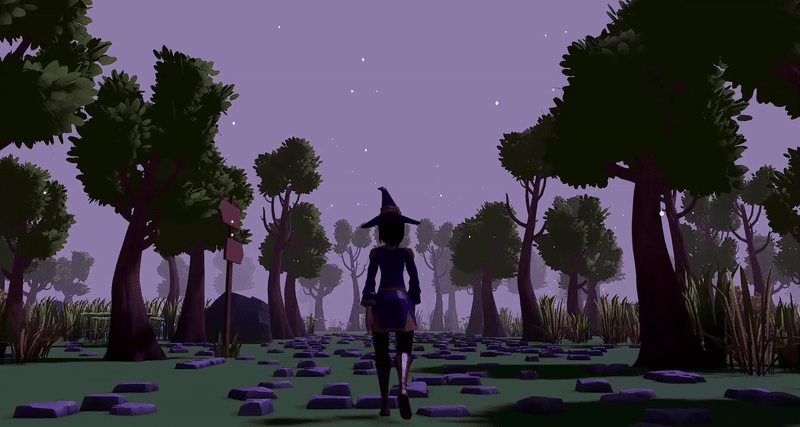
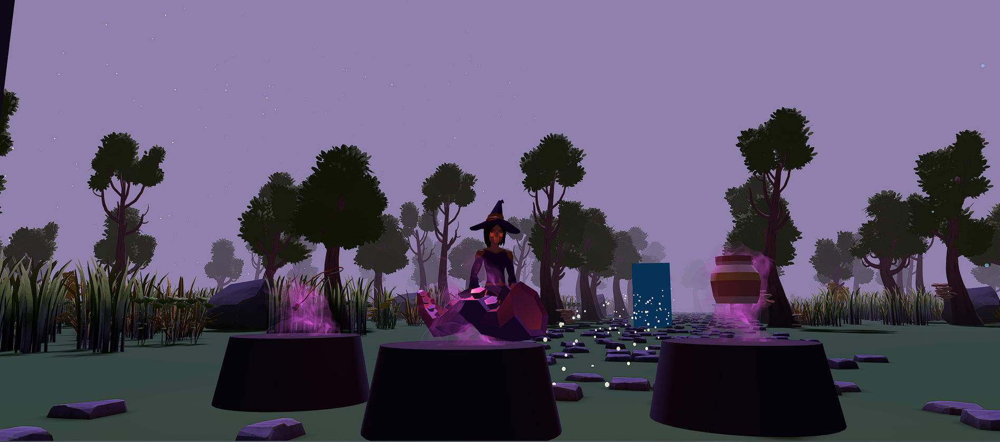
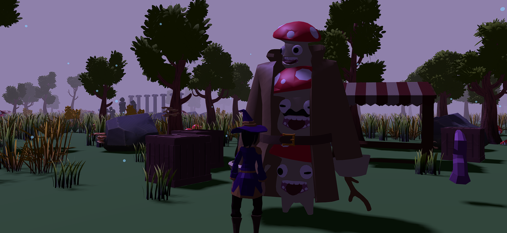

# A Lost Witch Tale

**A Lost Witch Tale** is a fantasy exploration experience built with Three.js and Rapier.js.  
You are a young witch, lost in an enchanted forest. To return home, you must find three magical items, each guarded by a mysterious puzzle.  

---

## 🌙 Story

A curious young witch, drawn to forbidden magic, made a terrible mistake.

A spell went wrong. She was pulled into a mysterious forest.

Now, she must find a way to return...

---

## Controls

| Key        | Action            |
|------------|-------------------|
| `W A S D`  | Move the character |
| `Shift`    | Run               |
| `F`        | Interact (talk, pick up, activate) |
| `Mouse`    | Look around       |
| `9`    | Show world wireframes       |
| `P`    | Show character wireframe       |

---

## Environment Preview

Here are a few glimpses from inside the game world:






---

# How to run the game locally 

To try the game on your computer, follow these steps:

## Requirements
- [Node.js](https://nodejs.org/) (version 16 or higher, 18+ recommended)

## Installation
1. Clone this repository:
   ```bash
   git clone https://github.com/alessiainf/Exploring-RPG-game.git
   cd Exploring-RPG-game
2. Install dependencies:
   ```bash
   npm install
  
4. Start the development server:
      ```bash
      npx vite

5. Open in your browser the link shown in the terminal (usually http://localhost:5173).

---

## Acknowledgments
Special thanks to **Quaternius** for making all 3D models freely available on [Poly Pizza](https://poly.pizza/u/Quaternius).  
All the assets used in this project come from his incredible collection.
